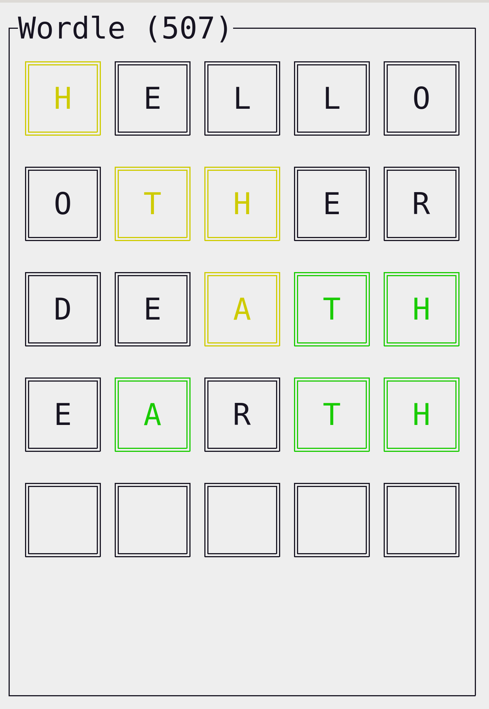
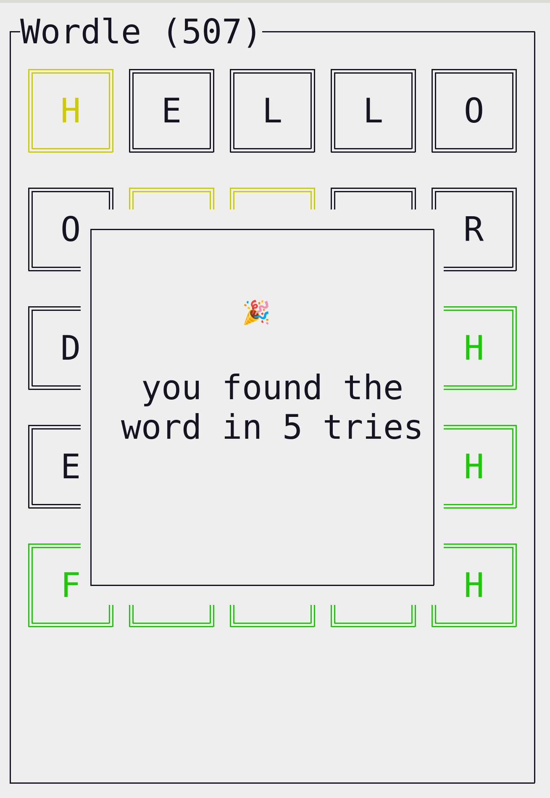

[](https://codecov.io/gh/lonepeon/wordle)

# Wordle

A simple TUI to play wordle.

| in progress                                   | success                                             |
|-----------------------------------------------|-----------------------------------------------------|
|  |  |


## Documentation

Documentation is available using `wordle --help`

```
USAGE:
    wordle [OPTIONS]

OPTIONS:
    -h, --help           Print help information
    -s, --seed <SEED>    Seed to use for randomization [default: 0]
    -V, --version        Print version information
```
